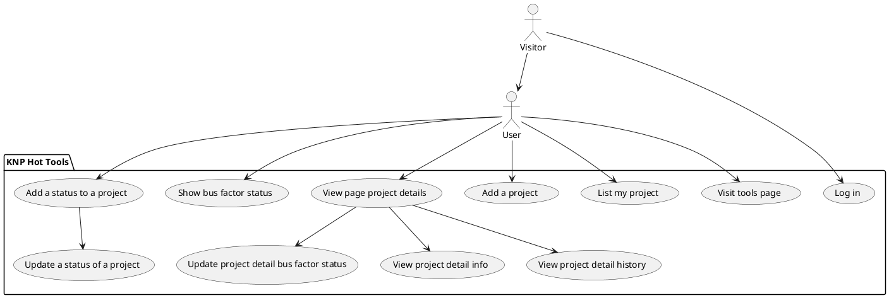
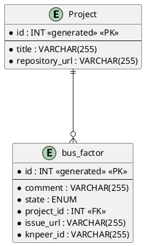
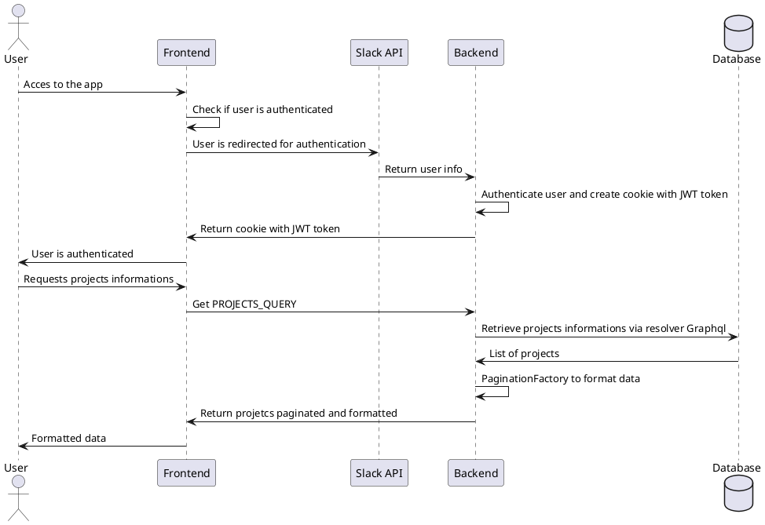

---
# try also 'default' to start simple
theme: apple-basic
# random image from a curated Unsplash collection by Anthony
# some information about your slides (markdown enabled)
title: Welcome to Knp Hot Tools
info: |
  ## Slidev Starter Template
  Presentation slides for developers.

  Learn more at [Sli.dev](https://sli.dev)
# apply UnoCSS classes to the current slide
class: text-center
# https://sli.dev/features/drawing
drawings:
  persist: false
# slide transition: https://sli.dev/guide/animations.html#slide-transitions
transition: slide-left
# enable Comark Syntax: https://comark.dev/syntax/markdown
comark: true
# duration of the presentation
duration: 40min
layout: center 
---

# Présentation Projet - Léo Grouet

  <v-click>
    

      

      
🌶️  KNP️ Hot Tools️️️ 

      

      
L'outil le plus chaud de ta région.

    

  </v-click>

  <v-click>
    
KNP Labs

  </v-click>

<GlobalBottom />
<!-- Slide = done -->

---
transition: slide-left
title: Pourquoi Le Hot tools ?
class: text-center color-[#163262]
layout: two-cols-header
---

<h1 class="justify-center flex color-[#163262] p-b-10">Le Hot tools, pourquoi Jamie?</h1>
<v-click><h2 class="m-t-10 justify-center flex color-[#163262] ">Organisation interne en teams</h2></v-click>
::left::
<v-click >
La team com
 <v-click>
 Geckosocial, Figma, Trello ...
</v-click> </v-click>
<v-click >
La team follow-up
 <v-click>
 CSV, Trello ...
</v-click></v-click>
::right::
<v-click >
La team FOSS
 <v-click>
 Aucun outils 
</v-click></v-click>
<v-click >
La team Training
<v-click>
 Trello, Slides.com
</v-click></v-click>
<v-click at="10">
Hot tools 🌶️ 
</v-click>
<v-click at="11">
 Etat actuel ------> 
</v-click>

<GlobalBottom />

<!-- 
Mettre des logos avec les outils utilises par chaque team et finir par le logo du hot tools au millieu pour relier tout le monde
 -->

---
transition: slide-left
title: Focus sur la team qualité
layout: image
image: ./images/CSV-Suivi-bus-factor.png
---

---
transition: fade-in
title: Le Hot tools, démo
class: color-[#163262]
---

  <h1 >Chauffe Marcel !</h1>
  
Direction le hot tools pour une démo de l'application, avec un focus sur les fonctionnalités de la team qualité.

<GlobalBottom />
---
transition: fade-in
title: La méthodologie projet
layout: two-cols
class: color-[#163262]
---

# Méthodologie projet

- Méthode Agile SCRUM
- Sprint 1 semaine
- Daily
- Démo toutes les fins de sprint
- Retro 2 semaines

::right::

<v-click>

# Outils collaboratifs

- Trello (Tâches, bugs)
- GitHub (Git flow, PR + code reviews, CI/CD) Xtreme programing
- Slack (échanges équipe et client)
- Google Meet (daily)
</v-click>
<GlobalBottom />

<!--
On a travaillé en mode Agile SCRUM

On faisait des sprints planning tout les lundi pour voir ce que j'emportais dans le sprint
-->

---
transition: fade-in
title: Le Hot tools, la team
class: color-[#163262]
---

# L'equipe projet

- Pédro et Clément : Les Clients
- Cécile : Facilitatrice
- Manon,Erwann, Maël et Arthur : Les développeurs de passage
- Léo : Développeur Fullstack
<GlobalBottom />
---
transition: slide-up
title: Le Hot tools, le MVP
class: color-[#163262]
---

# Minimum Viable Product - Extrait
| En tant que | Je souhaite                              | Afin de                                |
| ----------- | ---------------------------------------- | -------------------------------------- |
| visiteur    | me connecter                             | accéder aux outils de suivi            |
| utilisateur | visualiser la page des différents outils | accéder à un outil spécial             |
| utilisateur | visualiser mes projets                   | voir le suivi                          |
| utilisateur | ajouter un projet                        | gérer le suivi                         |
| utilisateur | modifier un projet                       | mettre à jour le bus factor* du projet |

<GlobalBottom />
<!-- 
 -->

---
transition: slide-left
title: Use cases du MVP
class: text-center color-[#163262]
---

# Diagramme de Cas d'utilisation

<GlobalBottom />
---
transition: slide-left
title: Wireframes Desktop
class: color-[#163262]
layout: two-cols
---

## Wireframes Desktop ( First )

- Wireframes fonctionnels
- Application sobre et simple d’utilisation

::right::

<v-click>

{width=500px}

</v-click>
<GlobalBottom />
<!-- Desktop first mais responsive car premiere cible, les devs de la boite avec leur matos du boulot donc -> Ordi -->

---
transition: slide-left
title: Wireframes Mobile
class: color-[#163262]
layout: two-cols
---

## Wireframe Mobile ( Responsive )

::right::

<v-click>

{width=250px}

</v-click>
<GlobalBottom />

---
transition: slide-left
title: Maquettes
layout: two-cols
class: color-[#163262]
---

# Maquettes
::right::
{width=450px}

<GlobalBottom />
---
transition: slide-left
title: La conception
layout: two-cols
class: color-[#163262]
---

# Conception technique
## Modèle de données

- ERD: Projet, Bus factor
- Relations claires

::right::

<v-click>

</v-click>
<GlobalBottom />
<!-- 
- Relations :
  - Un projet peut avoir plusieurs bus factor
  - Un bus factor est lié à un seul projet

  ermis de limiter la production de documents conceptuels.
  
-->

---
transition: slide-left
title: Schéma d'architecture
class: color-[#163262] flex flex-col items-center
---

# Schéma d'architecture

<v-click>

{width=600px}

</v-click>
<GlobalBottom />
<!-- 
Architecture en 4 blocs bien distincts :
- Frontend : Next.js, React, Tailwindcss, Graphql
- Backend : Symfony, API REST
- Base de données : MySQL
- Nginx : Reverse proxy pour gérer les requêtes entrantes et les rediriger vers le backend ou le frontend selon les besoins
 -->

---
transition: slide-left
title: Choix technique front
class: color-[#163262] gap-4 flex flex-col items-right ml-40
layout: two-cols
---

# Frontend
## Next.js

<v-click>- React + Typescript</v-click>
<v-click>- Tailwindcss</v-click>
<v-click>- Graphql ( Codegen )</v-click>

:: right ::

  {width=80px}

<v-click at="1">

  {width=80px}

</v-click>
<v-click at="2">

  {width=80px}

</v-click>
<v-click at="3">

  {width=80px}

</v-click>
<GlobalBottom />
<!-- 
- Next => CRA React deprécié et ils encouragent a passer sur Next pour les avantages de ce framework (SSR, SSG, API routes, etc)
- Projet pilote pour tester Next.js en interne, on voulait aussi un framework moderne et populaire pour le frontend
- File routing de Next.js pour une navigation simple et rapide
- Premier chargement rapide (FCP) : Contrairement à une SPA pure (Create React App) qui affiche un écran blanc puis charge le JS, Next.js envoie du HTML prêt à l'emploi. L'outil est utilisable immédiatement, même sur des connexions lentes ou des machines anciennes.
- Données sécurisées côté serveur : Vous pouvez fetcher des données sensibles directement dans le composant serveur (getServerSideProps ou Server Components) sans jamais exposer les clés API ou les données brutes au navigateur du client. C'est crucial pour une app interne contenant des données RH, financières ou stratégiques.

-->

---
transition: slide-left
title: Atomic design
class: color-[#163262] flex flex-col items-center gap-10
---

# Atomic design

{width=400px}
  <GlobalBottom />
---
transition: slide-left
title: Atomic design - Atom
class: color-[#163262] flex flex-col items-center gap-10
---

# Atomic design - Atom

<<< snippets/Card.tsx {all|5|11-13}{maxHeight:'400px'}
<GlobalBottom />
---
transition: slide-left
title: Atomic design - Molecule
class: color-[#163262] flex flex-col items-center gap-10
---

# Atomic design - Molecule

<<< snippets/HistoryMobilCard.tsx {all|1|17|53}{maxHeight:'400px'}
<GlobalBottom />
---
transition: slide-left
title: Atomic design - Organism
class: color-[#163262] flex flex-col items-center gap-10
---

# Atomic design - Organism

<<< snippets/ProjectBusFactorsHistory.tsx {all|2|63-65}{maxHeight:'300px'}
<GlobalBottom />
---
transition: slide-left
title: Risky Beginning
class: color-[#163262] flex flex-col items-center gap-10
---

# Risky Beginning

{width=400px}

<v-click>
Contrebalancé avec ...
</v-click>
<GlobalBottom />
<!-- 

- Utiliser l'image des boites empilées pour représenter les risques liés à l'utilisation de technologies non maîtrisées

*Unstable (beta/alpha version)** (+):
**Need to Learn, Acquire Skill** (+): 
**Poorly Documented** (+): 
**Not Maintained Anymore** (+): 
**Never Used at KNP** (+): 
**Hard to Test/Lack of Test Tooling** (+): 
**No KNPeers Interested in Learning It** (+): 

-->

---
transition: slide-left
title: Choix Technique Backend
class: color-[#163262] gap-2 flex flex-col items-right ml-40
layout: two-cols
---

# Backend
Symfony v7.2
<v-click>- Doctrine </v-click>
<v-click>- Graphql API </v-click>
<v-click>- Authentification Slack </v-click>
<v-click>- JWT Token et Cookie </v-click>

<v-click>
Socle solide - Risky Begining
</v-click>

:: right ::

  {width=80px}

<v-click at="1">

  {width=80px}

</v-click>
<v-click at="2">

  {width=80px}

</v-click>
<GlobalBottom />
<!-- 

 -->

---
transition: slide-left
title: Architecture Hexagonale
class: text-center color-[#163262] flex flex-col items-center
---

# Architecture Hexagonale
Schéma de l'architecture hexagonale

{width=550px}
<GlobalBottom />
<!-- 
Domain : Agnostic des autres élements
Application : Controlle les flux de données entre le domaine et les ports
Infrastructure : Implémente les ports pour interagir avec les systèmes externes (DB, API, etc)

Si bien fait, permet de changer tout ou partie des outils utilisés dans l'infra sans jamais toucher au code d'autre couche
 -->

---
transition: slide-left
title: Choix technique base de données
class: color-[#163262] gap-4 flex flex-col ml-20
layout: image-right
image: ../images/mysql-icon.png
backgroundSize: contain
---

# SGBDR

 - MySQL 9.1 

<v-click>- Open source, robuste et performant</v-click>

<GlobalBottom />

---
transition: slide-left
title: Containerisation Docker
layout: image-right
image: ../images/docker.svg
backgroundSize: contain
---

# Containerisation Docker
- Docker Compose multi-environnements
- Dev, test, staging, prod

<GlobalBottom />
---
transition: slide-left
title: Docker compose multi-environnements
class: color-[#163262]
layout: default
---

# Environnements Docker

- Environnements optimisés pour chaque étape du développement à la prod

<v-switch>
  <template #1>

`compose.dev.yaml`:
<<< @/snippets/compose.dev.yml yaml {*}{maxHeight:'300px'}
  </template>
  <template #2>

`compose.test.yaml`:
<<< @/snippets/compose.test.yml yaml {*}{maxHeight:'300px'}
  </template>
  <template #3>

`compose.staging.yaml`:
<<< @/snippets/compose.staging.yml yaml {*}{maxHeight:'300px'}
  </template>
</v-switch>

<!-- 
- Dev : Frontend qui depends de PHP qui depends de la BDD qui a un healthcheck , Nginx , Adminer, Playwrught pour les tests end to end
- Test : Frontend qui branché en network avec playwright , PHP qui depends de la BDD qui a un healthcheck , Nginx , Playwrught qui depends du frontend sinon peut pas jouer les tests - Pas de volume
- Staging : Frontend qui depends de PHP qui depends de la BDD qui a un healthcheck , Nginx et Traefik
 -->

<GlobalBottom />
---
transition: slide-left
title: Diagramme de sequence
class: text-center color-[#163262]
layout: default
---

# Diagramme de sequence - Page projets
<v-click >

</v-click>
<GlobalBottom />
---
transition: slide-left
title: Dans le code 
class: color-[#163262] flex flex-col
---

# Enchainement des fonctions

<v-click> 1. Middleware </v-click>
<v-click> 2. Authentification </v-click>
<v-click> 3. Frontend </v-click>
<v-click> 4. Backend </v-click>
<GlobalBottom />
---
transition: slide-left
title: Dans le code ? - Middleware
class: color-[#163262]
---

# Le middleware front
<<< snippets/middleware.ts {all|18-30}{maxHeight:'400px'}
<GlobalBottom />
---
transition: slide-left
title: Slack API - Authentification
class: color-[#163262]
---

# L'authentification Slack
<<< snippets/SlackAuthenticator.php {all|5|17|64-78}{maxHeight:'400px'}
<GlobalBottom />
---
transition: slide-left
class: color-[#163262] flex flex-col gap-10
layout: default
---

# Frontend - Les projets

<<< snippets/ProjectPage.tsx {all|1|10-15|16-19|41-47}{maxHeight:'350px'}
<GlobalBottom />
<!-- 
[click] Fonction async pour ne pas bloquer le rendu 
[click] Le await pour matché l'appel async et déclencher comme c'est résolu 
[click] Catch l'erreur et set les projets a tableau vide pour eviter tout probleme de rendu
[click] Display des projets avec une boucle sur le composant ProjectCard { Atomic design )
 -->

---
transition: slide-left
title: Requete graphql - frontend
class: color-[#163262] flex flex-col gap-6
layout: default
---

# Requete Graphql - Frontend

<v-click at="2"> Codegen pour un typage fort </v-click>

<<< snippets/fetchProjects.ts {all|1|6-9}{maxHeight:'400px'}
<GlobalBottom />
---
transition: slide-left
title: API Symfony - Projects
class: color-[#163262]
---

# API Symfony - Les projets

<<< snippets/Projects.php {all|1|12-13|14|15-24}{maxHeight:'400px'}

<!-- 
[click] Annotation "provider" graphql bundle pour faire le lien entre la requete graphql et la methode query en opposition a post 
[click] Annotation pour signaler le nom de la query pour que le lien avec la requete front 
[click] __invoke pour faire du controller invokable et limiter le code a une seule methode
[click] Logique de la fonction : findAll project , creation de projectType avec boucle 
-->
<GlobalBottom />
---
transition: slide-left
title: Projet - Domain Model
class: color-[#163262] gap-10 flex flex-col
---

# L'objet Projet - Domain Model

<<< snippets/ProjectEntity.php {all|5-7|9-15}{maxHeight:'350px'}

<!-- 
[click] Entity projet pour PHP
[click] Propriétés : id, title, repositoryUrl
[click] Getters et setters pour chaque propriété

 -->
<GlobalBottom />
---
transition: slide-left
title: Projet - Infrastructure Mapping
class: color-[#163262]
---

# XML - Mapping

- Infrastructure / Domain

<<< snippets/Project.orm.xml {all|7|8-31|}{maxHeight:'320px'}

<GlobalBottom />
---
transition: slide-left
title: Une feature Sabine !
class: color-[#163262]
---

# Une feature Sabine !
 - Bus factors : Cycle de vie
 - Notification Slack
 - Mise à jour automatique sur l'application

<GlobalBottom />
---
transition: slide-left
title: Status bus
class: color-[#163262] flex flex-col gap-6 
layout: image-right
image: ../images/statut.png
---

# Statut de bus factor

- Initialisation de statut 
- Plannifier
- Issue crée
- A jour 
- Obsolète
- Inactif

<GlobalBottom />
---
transition: slide-left
title: Create Bus Action
class: color-[#163262]
---

# Creation de bus - Traitement du formulaire

<<< snippets/create-bus-factor-action.ts {all|1|10-18|42-60}{maxHeight:'350px'}

<GlobalBottom />
---
transition: slide-left
title: API Create bus
class: color-[#163262]
---

# Création du bus factor

<<< snippets/CreateBusFactor.php {all|3|10-22|32}{maxHeight:'350px'}

<GlobalBottom />
---
transition: slide-left
title: Notification Slack
class: color-[#163262]
---

# Notifications Slack
 - Plannifié / Issue Crée
<<< snippets/SlackNotifier.php {all|3|5-11}{maxHeight:'350px'}

<GlobalBottom />
---
transition: slide-left
title: automatisation slack
class: color-[#163262]
---

# Automatisation GitHub

- Issue closed

<<< snippets/WebhookController.php {all|3|10|31-39}{maxHeight:'350px'}

<GlobalBottom />
---
transition: slide-left
title: Test Front
class: color-[#163262]
---

# Test front
 - Snapshots/Unitaire ... 
 - test coverage
<<< snippets/ProjectDetails.test.tsx {all|1-16|18-25}{maxHeight:'340px'}

<GlobalBottom />
---
transition: slide-left
title: Test Back
class: color-[#163262]
---

# Test Back

<<< snippets/CreateBusFactorTest.php {all|3|4|5-18|24-29|31-41|42-47|49-52}{maxHeight:'340px'}

<GlobalBottom />

---
transition: slide-left
title: CI
class: color-[#163262]
---

#  Pipeline CI-CD : Continuous Integration 
 - Lint & Test Systematique
 - Workflow Github Actions ( Front, Back, E2E, Codegen)

`apps-frontend.yaml`:
<<< snippets/apps-frontend.yaml {all|2|4-6|8-10|12-21|23-26|28-35}{maxHeight:'300px'}

<GlobalBottom />
---
transition: slide-left
title: CD
class: color-[#163262]
---

# Pipeline CI-CD : Continuous Deployment

 - Déploiement automatique en staging pour chaque PR validée
 - Tags

`deploy-staging.yaml`:
<<< snippets/deploy-staging.yaml {all|1|3-5|7-9|11-15|16-27|29-30|45-49|51-58|60-61|63-69|71-75}{maxHeight:'300px'}

<GlobalBottom />

---
transition: slide-left
title: Sécurité et RGPD
class: color-[#163262]
---

# Sécurité et RGPD
- Authentification Slack : Consentement et sécurité
- JWT : Stockage sécurisé en cookie HttpOnly
1. Protection contre faille de sécurité :
  - Doctrine pour éviter les injections SQL
  - React pour éviter les attaques XSS
  - CSRF : Cookie::SameSite=lax

<GlobalBottom />
---
transition: slide-left
title: Problemes rencontrés
class: color-[#163262] flex flex-col gap-6
---

# Les problèmes rencontrés

<v-click>Compréhension de l'architecture hexagonale</v-click>

<v-click>ADR : Appolo client</v-click>

<v-click class="flex flex-col gap-2">
Communication client : 
    

      - Changement de cap en cours de projet
    

      
- Assurance personnelle

</v-click>

<GlobalBottom />
---
transition: slide-left
title: Conclusion projet
class: color-[#163262] gap-6 flex flex-col
layout: default
--- 

# Conclusion
## Le projet

  - Architecture héxagonale
  - Monté en compétences sur Next.js et Symfony
  - Méthodo Agile

  ## Le futur du projet ?
  
<GlobalBottom />
---
transition: slide-left
title: Conclusion personnel
class: color-[#163262] gap-6 flex flex-col
layout: default
--- 

# Conclusion
## Personnelle 

 - Projet utile 
 - Experience entreprise
 - Reconversion réussie : CDI
  
---
transition: slide-left
title: Merci pour votre attention !
class: color-[#163262] flex flex-col gap-10
layout: default
---

# Merci pour votre attention !

## Des questions ?
